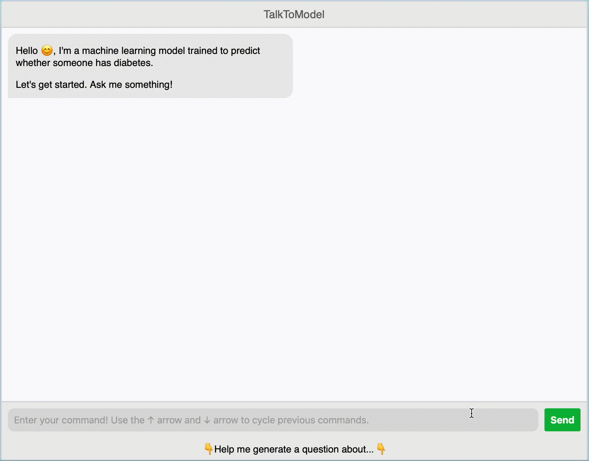

# TalkToModel: Understanding Machine Learning Models With Open Ended Dialogues

[](https://github.com/dylan-slack/TalkToModel/actions/workflows/python-app.yml) [](https://arxiv.org/abs/2207.04154)


Welcome to the [TalkToModel paper](https://arxiv.org/abs/2207.04154) repo! The goal of this project is to enable anyone to understand a machine learning model through a natural language conversation.

<p align="center">

&nbsp;&nbsp;&nbsp;

</p>

## Quick Links

- Check out the [arXiv TalkToModel paper](https://arxiv.org/abs/2207.04154) ✨
- We are hosting a [demo of TalkToModel](https://nlp.ics.uci.edu/talk-to-healthcare-model/) on the diabetes prediction task 🚀

If you found this work useful, please cite us! 

```bibtex
@inproceedings{ttm:arXiv,  
 author = {Dylan Slack and Satyapriya Krishna and Himabindu Lakkaraju and Sameer Singh},  
 title = {TalkToModel: Understanding Machine Learning Models With Open-Ended Dialogues},  
 booktitle = {arXiv},  
 year = {2022}
 }
```

We additionally wrote a [precursor paper](https://arxiv.org/abs/2202.01875) about domain experts needs for understanding models, that helped inspire this work. It's called *Rethinking Explainability as a Dialogue: A Practitioner's Perspective*. Check that out as well!


## Table of Contents

- [Overview](#Overview)
- [Installation](#Installation)
- [Running the TalkToModel Application](#running-the-talktomodel-application)
- [Running On Your Own Model & Dataset](#running-on-your-own-model--dataset)
- [Experiments](#experiments)
- [Development]()

## Overview

Here follows a brief overview of the purpose and scope of the system.

### Purpose

As machine learning models are being increasingly integrated in our day-to-day lives, it becomes important that anyone can interact with and understand them. TalkToModel helps realize this goal and enables *anyone* to chat with a machine learning model to understand the model's predictions.

Please [read our paper](https://arxiv.org/abs/2207.04154) for more motivation and details about how the system works.

### Scope

TalkToModel supports *tabular* models and datasets. For example, you could use the system to chat with a random forrest trained on a loan prediction task but not BERT trained on a sentiment analysis task, in the system's current form.

## Installation

To run TalkToModel, you can either setup a conda environment or use Docker to directly run the Flask App.

### Docker

If you want to use Docker, you can skip this setup step ⏭️

### Conda

Create the environment and install dependencies.

```shell
conda create -n ttm python=3.9
conda activate ttm
```

Install the requirements

```shell
pip install -r requirements.txt
```

Nice work 👍

## Running A Pre-Configured TalkToModel Demo

Next, we discuss how to run the Flask Application on one of the datasets and models from [the paper](https://arxiv.org/abs/2207.04154). These include a diabetes, crime, and credit prediction task.

### Configuration 

Here, we talk about choosing a demo + parsing model. If you just want to run the demo on the diabetes dataset, you can skip to [Running With Conda](#running-with-conda) or [Running With Docker](#running-with-docker). 

#### Choosing a Demo & Parsing Model
This software is configured using [gin-config](https://github.com/google/gin-config). Global parameters are stored in `./global_config.gin` and demo specific parameters are stored in the `./configs` directory, e.g., `./configs/diabetes-config.gin` for the diabetes prediction demo.

This repo comes configured using a fine-tuned `t5-small` model for the diabetes prediction task, but this can be changed by modifying `./global_config.gin`:

```shell
GlobalArgs.config = "./configs/{demo}-config.gin"
```

and changing `{demo}` to one of `diabetes`, `compas`, or `german` respectively. Further, we provide our best fine-tuned `t5-small` and `t5-large` parsing models on the huggingface hub. These can be selected by modifying `./configs/{demo}-config.gin`:

```shell
# For the t5 small model
ExplainBot.parsing_model_name = "ucinlp/{demo}-t5-small"
# For the t5 large model
ExplainBot.parsing_model_name = "ucinlp/{demo}-t5-large"
```

and the respective parsing model will be downloaded from the hub automatically.

#### GPU Availability 

By default, the system will try to push the models to a cuda device and will crash if one isn't available. To switch to CPU inference or to use a different cuda device, modify `./parsing/t5/gin_configs/t5-large.gin`

```shell
load_t5_params.device = "{device}"
```

where `{device}` is the device you want (e.g., `cpu`).

### Running With Conda

If you installed the conda environment, to launch the [Flask](https://flask.palletsprojects.com/en/2.2.x/) web app you can run
```shell
python flask_app.py
```

### Running With Docker

If you want to run with [Docker](https://www.docker.com), you can build the docker app

```shell
sudo docker build -t ttm .
```

And then run the image

```shell
sudo docker run -d -p 4000:4000 ttm
```

### Use It!

It might take a minute or two to build the application. The reason is that we cache a fair number of computations (mostly explanations) beforehand to improve the realtime user experience. For reference, on my M1 macbook pro, building from scratch takes about 5 minutes. However, after your first time running a demo, these computations will be stored in the `./cache` folder, and it is not necessary to compute them again, so startup should be very quick. 

That's it! The app should be running 💥

## Experiments

Here, we discuss running experiments from the paper. For these experiments, make sure to set

```
ExplainBot.skip_prompts = False
```

in each of the `diabetes`, `german`, and `compas` gin config files, so that the system generates the prompts for each dataset. We set this to `True` for the fine-tuned demo parsing models, because it is unnecessary in this case and speeds up the startup time significantly. 

### Fine-tuning Models

To fine-tune a parsing model, run 

```shell
python parsing/t5/start_fine_tuning.py --gin parsing/t5/gin_configs/t5-{small, base, large}.gin --dataset {diabetes, german, compas}
```

where `{small, base, large}` and `{diabetes, german, compas}` are one of the values in the set. Note, these experiments require use [Weights & Biases](https://wandb.ai/site) to track training and the best validation model.

For simplicity, we also provide all the best validation pre-trained models for download on huggingface: [https://huggingface.co/dslack/all-finetuned-ttm-models](https://huggingface.co/dslack/all-finetuned-ttm-models). You can download these models from the provided zip file, and unzip the models to `./parsing/t5/models`.

### Evaluating Gold Parsing Accuracy

With all the models downloaded, you can compute the parsing accuracies by running

```shell
python experiments/generate_parsing_results.py
```

The results will be deposited in the `./experiments/results_store` directory.

## Running on Your Own Model & Dataset

Please see the tutorial `./tutorials/running-on-your-own-model.ipynb` for a step-by-step walk-through about how to do this, and the different options you have for setting up the conversation.

## Development

TalkToModel can be extended to include new functionality pretty easily. Please see `./tutorials/extending-ttm.md` for a walk-through on how to extend the system.

## Testing

You can run the tests by running `pytest` from the base directory.

## Citation

Cite us 🫶

```bibtex
@inproceedings{ttm:arXiv,  
 author = {Dylan Slack and Satyapriya Krishna and Himabindu Lakkaraju and Sameer Singh},  
 title = {TalkToModel: Understanding Machine Learning Models With Open-Ended Dialogues},  
 booktitle = {arXiv},  
 year = {2022}
 }
```

## Contact 

You can reach out to [dslack@uci.edu](dslack@uci.edu) with any questions.


